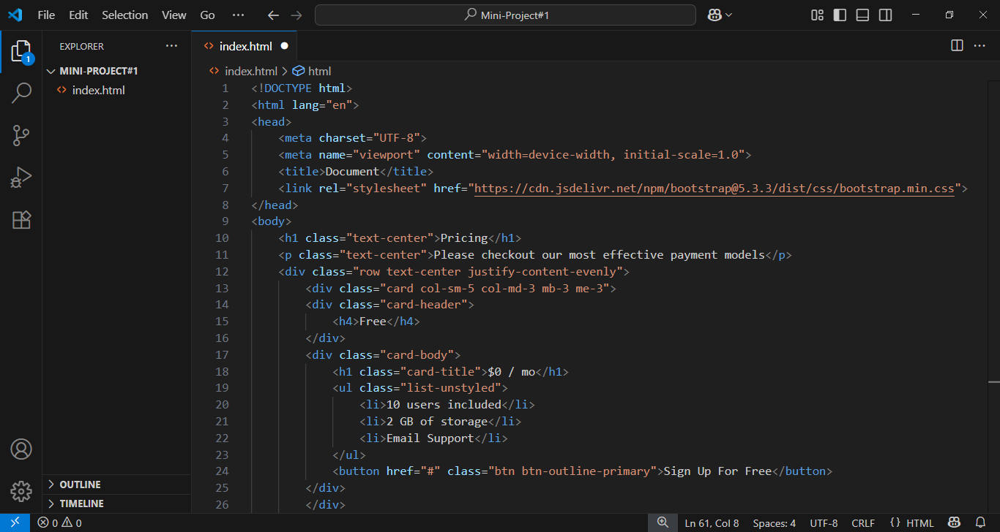

# 💳 Pricing Plan UI – Mini Frontend Project

This is a simple and clean **Pricing Plan webpage** built using **HTML5** and **Bootstrap 5**. It displays three pricing cards (Free, Pro, Enterprise) and is fully responsive across all devices. The project was created as part of my frontend development practice during my MERN Stack learning journey.

---

## 🚀 Live Demo

👉 [View Project on GitHub Pages](https://Murtajiz-Abbas.github.io/miniProject-1/)

---

## 📸 Screenshots

### 💻 UI Preview


### 🧑‍💻 VS Code Editor


---

## 🔑 Features

- Responsive layout using Bootstrap Grid System
- Card-based pricing plans
- Custom buttons and icons
- Clean and simple design

---

## 🛠️ Technologies Used

- HTML5  
- Bootstrap 5 (via CDN)  
- CSS (minimal, inline/custom)

---

## 📂 How to Run Locally

```bash
git clone https://github.com/Murtajiz-Abbas/miniProject-1.git
cd miniProject-1
open index.html in your browser
```

Or simply double-click the `index.html` file after downloading.

---

## 👨‍💻 Author

**Murtajiz Abbas Bukhari**  
📚 BS Computer Science (2022–2026)  
🏫 Abbottabad University of Science & Technology (AUST)  
📧 syedmurtajiz8614@gmail.com  
🔗 [LinkedIn Profile](https://www.linkedin.com/in/murtajiz-abbas-bukhari-0114aa376/)

---

## ⚖️ License

This project is open-source and free to use for educational, personal, or portfolio purposes.