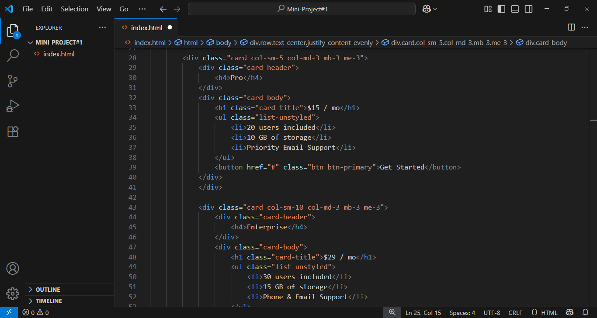
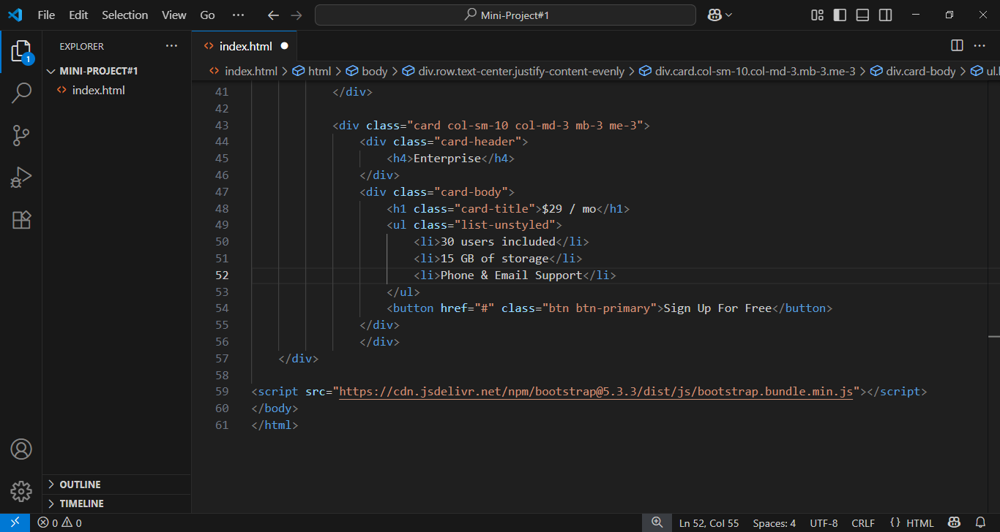

# 💳 Pricing Plan Page – HTML & Bootstrap 5

This is a simple and responsive **Pricing Plan** web page built using **HTML5** and **Bootstrap 5**. It features three pricing tiers: **Free**, **Pro**, and **Enterprise** — each displayed as a card with plan details.

---

## 🔗 Live Demo

👉 [Click here to view the live Pricing Page](https://Murtajiz-Abbas.github.io/miniProject-1/)


## 📸 Screenshots





---

## 🔧 Technologies Used

- **HTML5**
- **Bootstrap 5 (via CDN)**

---

## 💡 Features

- 📱 Responsive layout using Bootstrap Grid System  
- 🃏 Card-based pricing plans (Free, Pro, Enterprise)  
- 🎯 Clean UI with buttons, headers, and feature lists  
- ✉️ Different support and storage levels per plan  

---

## 🚀 How to Use

1. Clone the repository:
   ```bash
   git clone https://github.com/Murtajiz-Abbas/miniProject-1.git
   ```
2. Open the `index.html` file in any modern web browser.

---

## 🧑‍💻 Author

**Murtajiz Abbas Bukhari**  
📍 BSCS student – Abbottabad University of Science & Technology  
🌐 [LinkedIn Profile](https://www.linkedin.com/in/murtajiz-abbas-bukhari-0114aa376/)  | 📫 Email: [syedmurtajiz8614@gmail.com]

---

**About**  
A mini frontend UI project developed during my MERN Stack learning journey to strengthen fundamental skills in HTML and Bootstrap layout design.

---

## 📜 License

This project is open-source and free to use for educational and personal purposes.